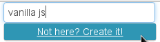

jq-autocomplete
=================================

Very simple autocomplete for text input field.

Getting started
---------------

### How?

HTML:

```
<script type="text/javascript" src="jq-autocomplete.js"></script>
<link rel="stylesheet" href="jq-autocomplete.css"/>

<input type="text" id="my-autocomplete" />
```

JS:

```
$('#my-autocomplete').jqAutoComplete();
```

Results:

Suggestions are automatically added below the input field:


Select active result using up / down key or click with your mouse:


### Advanced

#### HTML initialization
Plugin can be initialized using html5 data attribute.

Every option can be inlined such as:

```
<input type="text"
       data-url="/query"
       data-method="get"
/>
```

#### Cache
A cache is automatically managed by autocomplete (but it can be disabled). It means that the first time a query is sent, results are automatically saved. Next time, results will be retrieved from cache and the HTTP request will not be executed again.

#### Creation
Autocomplete can display a creation form if user want to be able to create new suggestion.
At creation, the autocomplete will have to know the form to used. The form will be cloned and a link to display the form will be automatically visible to create new suggestions (see samples).

A link is automatically added to display a form that will create new entry:



Form is cloned and automatically added:


#### Destroy
Don't worry about memory management, plugin will be automatically destroyed when related input is removed from DOM.

### Options

Note that callbacks are more documented below.

- `url`: URL used to fetch results.
- `method`: HTTP method used to fetch results. Default is `GET`.
- `minSize`: : Minimum number of characters required to trigger autocomplete. Default is `3`.
- `limit`: Maximum number of results to retrieve (will be sent over http). Default is `10`.
- `filterName`: Name of parameter containing filter value. Default is `filter`.
- `limitName`: Name of parameter containing limit value. Default is `limit`.
- `datas`: Custom parameter that will added to the fetch query. Default is `null` (it means that no additional parameter is sent).
- `cache`: Boolean value indicating whether to cache autocomplete results. Default is `true`.
- `label`: Field to show in suggestions list. Can be a string (field that will be display) or a function (must return the formatted field to display). Default is `label`.
- `relativeTo`: Suggestion list will be in absolute position. Relative position will be appended to input parent by default, unless an other selector is set using this option. Default is `null`. 
- `$createForm`: Form that will be display to create new result.
- `saveUrl`: URL that will be used to save current result. Default is the GET url.
- `saveMethod`: HTTP method that will be used to save new result. Default is `POST`.
- `saveDataType`: Content-Type returned by creation request. Default is `json`.
- `saveContentType`: Content-Type added to creation request. Default is `application/x-www-form-urlencoded; charset=UTF-8`.
- `createLabel`: Link displayed to show creation form. Default is `Not here? Create it!`.
- `cancel`: Label displayed in cancel 'button' (in creation form). Default is `Cancel`.
- `submit`: Label displayed in submit 'button' (in creation form). Default is `Save`.
- `select`: Callback function called when a suggestion result is selected.
- `unSelect`: Callback function called when selected result is "un-selected".
- `onShown`: Callback function called when suggestion list is displayed.
- `onHidden`: Callback function called when suggestion list is hidden.
- `isValid`: Callback function used to check validity of creation form and called before creation request. If function return a falsy value, creation request will not be triggered.
- `focusout`: Callback function called when focus out event is triggered.
- `onSaved`: Callback function called before creation request. Returned object will be used as parameter during creation request (useful to override some parameter).
- `onSavedSuccess`: Callback function called after creation request succeed.
- `onSavedFailed`: Callback function called after creation request failed.
- `onDestroyed`: Callback function called when autocomplete plugin is destroyed.

### API

#### Callbacks

Following callbacks can be set at initialization:

# `function label(obj) : {string}`

Callback that can be defined to return the formatted string to display in suggestion list.

# `function select(obj)`

Callback called when an element is selected. First parameter of callback is the new selected element.

# `function unSelect()`

Callback called when element is de-selected.

# `function onShown()`

Callback called when suggestions list (or creation form) is displayed.

# `function onHidden()`

Callback called when suggestions list (or creation form) is hidden.

# `function focusout()`

Callback called when 'focus out' event is triggered on input.

# `function isValid(data, $form) : {*}`

Callback called before creation of new entry.

Parameters:
- `data` First parameter is the form serialized as an object.
- `$form` Second parameter is the form.

Returns:

Whatever, a **falsy value** (a.k.a. `0`, `false`, `''`, `null` or `undefined`) means that the form is **not valid**, a **truthy value** means that the form is **valid**.

# `function onSaved(data) : {object}`

Callback that can be used to override saved data before request.

Parameters:
- `data` Data that will be saved.

# `function onSavedSuccess(data, textStatus, jqXHR)`

Callback called when creation request succeed.

Parameters:
- `data` Response.
- `textStatus` Status as formatted string.
- `jqXhr` Original XHR.

# `function onSavedFailed(jqXhr, textStatus, errorThrown)`

Callback called when creation request failed.

Parameters:
- `jqXhr` Original XHR.
- `textStatus` Status as formatted string.
- `errorThrown` Exception object if one occured.

# `function onDestroyed()`

Callback called when plugin is destroyed.

#### Public methods

Autocomplete instance has following methods:

# `function hide()`:

Hide auto-complete results (or creation form).

# `function show()`

Show auto-complete results.

# `clearCache`: `function()`

Clear auto-complete cache.

# `function empty()`

- Clear autocomplete:
  - Clear and hide suggestions.
  - Deselect active result.

- Clear input value.

# `function clear()`

- Clear autocomplete:
  - Clear and hide suggestions.
  - Deselect active result.
- Input value is not updated.

# `function val([data])` - Get / Set auto-complete value.

- If function is called without parameter, current selected value is returned.
- If function is called with a parameter, selected value is updated with parameter value.

# `function destroy()`

Destroy plugin:
- Clear internal data.
- Unbind user events.
- Remove DOM elements created by plugin.

### License

jq-autocomplete is freely distributable under the terms of an MIT-style license.

Copyright notice and permission notice shall be included in all copies or substantial portions of the Software.

### Credits

Author: Mickael Jeanroy / @mickaeljeanroy

